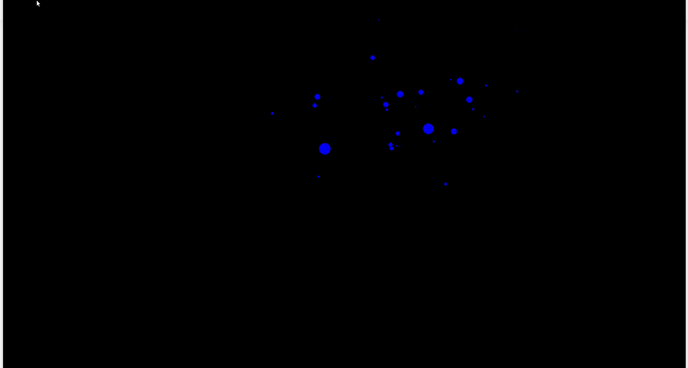

# N-body-sim
https://en.wikipedia.org/wiki/N-body_simulation

An N body simulation is a calculation of the physical motion of massive bodies that exert forces on one another. For example, the motion of the asteroids in an asteroid field is governed by their gravitational interactions. It turns out that when you have at least three asteroids, it's impossible to analytically predict the behavior of the system in advance--leading to mesmerizing visualizations. 

This simulator models the motion of asteroids in 2D space under 1/r^2 gravitational interactions. The asteroid diameters are proportional to their masses and are generated from a log-normal distribution.

## Running the simulator

Download the code and execute

**python simulate.py**

_Note: This program requires the graphics.py library, which is available from pip._

